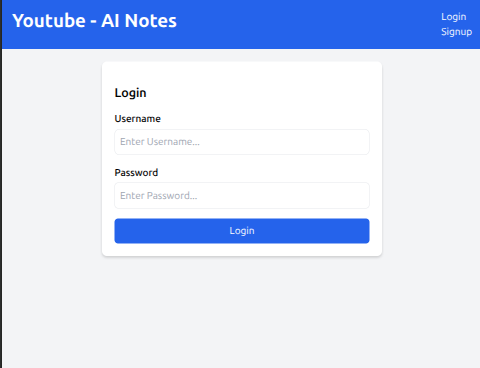
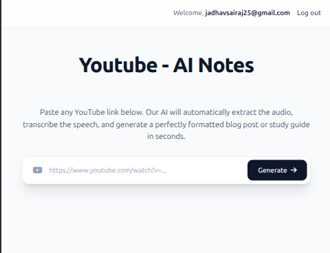
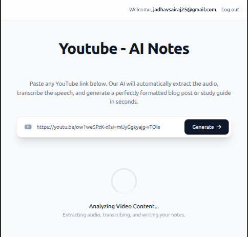
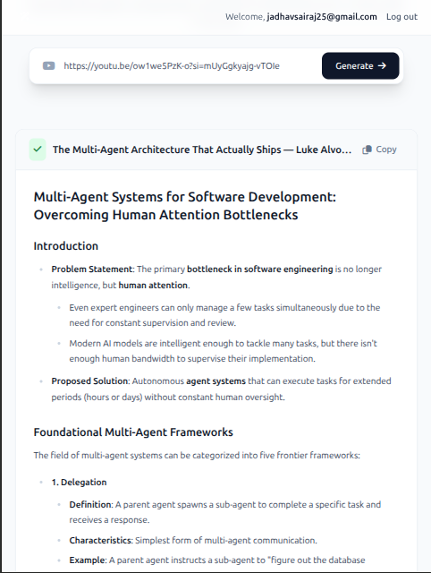

# 📝 YT-AI-Notes: YouTube to AI-Generated Notes


## 📖 Overview

**YT-AI-Notes** is a Django-powered web application that transforms YouTube videos into professional, structured revision notes using advanced AI. The application extracts audio from a YouTube URL, transcribes it to text using AssemblyAI, and leverages Google's Gemini 2.5 Flash model to generate clean, well-organized study notes.

### 🎯 **The Workflow:**
1. **Extract:** Downloads high-quality audio from YouTube via `yt-dlp`.
2. **Transcribe:** Converts speech to text accurately using AssemblyAI API.
3. **Generate:** Transforms the raw transcript into professional revision notes using Gemini 2.5 Flash AI model.

---

## 🚀 Key Features

- **Seamless URL Processing:** Simply paste a YouTube link to generate comprehensive notes.
- **Automated Audio Extraction:** Handles audio downloading and conversion entirely in the background.
- **AI-Powered Note Generation:** Creates structured, revision-friendly notes with:
  - Clear headings and subheadings
  - Bullet-point summaries
  - Highlighted keywords
  - Quick revision boxes
  - Actionable steps (when applicable)
- **User Authentication:** Secure login and signup system for users to save and manage generated notes.
- **User Dashboard:** Save, organize, and retrieve all previously generated notes.
- **Modern, Responsive UI:** Clean frontend built with Tailwind CSS.
- **RESTful API Design:** JSON-based endpoints for seamless content generation.

---

## 🧠 Tech Stack

| Component | Technology |
| :--- | :--- |
| **Python Version** | 3.10+ |
| **Backend Framework** | Django 5.2 |
| **Video/Audio Handler** | `yt-dlp` & FFmpeg |
| **Speech-to-Text API** | AssemblyAI |
| **Generative AI** | Google Gemini 2.5 Flash (`google-genai` SDK) |
| **Frontend** | HTML5, Tailwind CSS, JavaScript |
| **Database** | SQLite (Django ORM) |
| **Environment** | python-dotenv |

---

## 📚 How It Works

### User Flow:
1. **Sign Up / Log In** → Create an account or login to access the dashboard.
2. **Paste YouTube Link** → Enter any valid YouTube video URL on the home page.
3. **Generate Notes** → Click "Generate" to start the processing pipeline.
4. **View & Save** → AI-generated notes appear formatted and ready to use.
5. **Manage Notes** → Access all previously generated notes from your dashboard.

### Backend Process:
1. YouTube title is extracted without downloading the full video.
2. Audio is downloaded in MP3 format (64kbps) for optimal processing.
3. AssemblyAI transcribes the audio to text with high accuracy.
4. Gemini processes the transcript into structured, clean revision notes.
5. Notes are stored in the database linked to the user account.

---

## 📁 Project Structure

```
yt-ai-notes/
├── ai_blog_app/              # Django project settings & configuration
│   ├── settings.py           # Project settings, installed apps, middleware
│   ├── urls.py               # Main URL routing
│   ├── wsgi.py               # WSGI application
│   └── __init__.py           # Package initialization
├── blog_generator/           # Main Django application
│   ├── views.py              # Core business logic & API endpoints
│   ├── models.py             # Database models (BlogPost)
│   ├── urls.py               # App-level URL routing
│   ├── admin.py              # Django admin configuration
│   └── migrations/           # Database migration files
├── templates/                # HTML templates
│   ├── index.html            # Dashboard home page
│   ├── Login.html            # User login page
│   ├── signup.html           # User signup page
│   └── partials/             # Reusable template components
│       ├── blog_result.html  # Generated notes display
│       └── error.html        # Error message display
├── static/                   # Static files (CSS, JavaScript)
│   ├── css/                  # Tailwind CSS & custom styles
│   └── js/                   # Frontend JavaScript
├── media/                    # Temporary storage for audio files (ignored by Git)
├── manage.py                 # Django command-line utility
├── requirements.txt          # Python dependencies
├── .env                      # Environment variables (Not in Git)
├── .gitignore                # Git ignore rules
└── db.sqlite3                # SQLite database file

```

---

## 🔑 Core Components

### **Models (blog_generator/models.py)**
- **BlogPost:** Stores generated notes with user association, YouTube link, title, content, and timestamp.

### **Views (blog_generator/views.py)**

#### Main Endpoints:
- `index()` - Dashboard page (requires login)
- `generate_blog()` - POST endpoint that orchestrates the entire pipeline
- `user_login()` - Authentication endpoint
- `user_signup()` - New user registration
- `user_logout()` - Session termination

#### Helper Functions:
- `yt_title()` - Extracts YouTube video title using yt-dlp
- `download_audio()` - Downloads YouTube audio and converts to MP3
- `get_transcription()` - Calls AssemblyAI to convert audio to text
- `generate_blog_from_transcription()` - Uses Gemini to create structured notes

---

## 🎨 Frontend

- **Framework:** Tailwind CSS for responsive design
- **Interactivity:** Vanilla JavaScript for form handling and AJAX requests
- **Templates:** Django template language for dynamic content rendering
- **UI Elements:** Loading animations, error displays, and formatted note rendering

---

## 🔒 Security & Authentication

- Django's built-in authentication system ensures secure user management
- Login required decorator protects all sensitive endpoints
- User-specific note retrieval prevents unauthorized access
- Environment variables store sensitive API keys securely

---

## 📝 API Endpoints

| Endpoint | Method | Authentication | Purpose |
| :--- | :--- | :--- | :--- |
| `/` | GET | Required | Dashboard home page |
| `/generate-blog/` | POST | Required | Generate notes from YouTube link |
| `/login/` | GET, POST | Not Required | User login page |
| `/signup/` | GET, POST | Not Required | New user registration |
| `/logout/` | GET | Required | Logout user |

---

## 🌟 Future Enhancements

- [ ] Support for multiple output formats (PDF, Markdown, DOCX)
- [ ] Custom note templates and formatting options
- [ ] Batch processing for multiple YouTube links
- [ ] Export notes to popular study platforms
- [ ] Advanced search and filtering for saved notes
- [ ] Collaborative note sharing between users
- [ ] Mobile app version

---

## 📄 License

This project is licensed under the MIT License - see the [LICENSE](LICENSE) file for details.

---

## 🤝 Contributing

Contributions are welcome! Feel free to fork this repository and submit pull requests for any improvements.

---

## 📧 Contact & Support

---

## 🖼️ Application Preview

> A visual walkthrough of **YT-AI-Notes** — from login to AI-generated output.

---

### 🔐 Phase 1 — Authentication

> Users must log in (or sign up) before accessing the notes generator. The navbar provides quick links to **Login** and **Signup**.

<table>
  <tr>
    <td align="center">
      
      <br/>
      <b>🔑 Login Page</b>
      <br/>
      <sub>Username + password form · Navbar with Login / Signup links</sub>
    </td>
  </tr>
</table>

---

### 🏠 Phase 2 — Dashboard & URL Input

> After logging in, users land on the **dashboard**. They paste a YouTube URL into the input field and hit **Generate →** to kick off the pipeline.

<table>
  <tr>
    <td align="center" width="50%">
      
      <br/>
      <b>🏠 Dashboard – Ready State</b>
      <br/>
      <sub>YouTube URL input field · "Generate →" button · Welcome message with user email</sub>
    </td>
    <td align="center" width="50%">
      
      <br/>
      <b>⏳ Processing – Analyzing Video Content</b>
      <br/>
      <sub>Spinner animation · Status: "Extracting audio, transcribing, and writing your notes."</sub>
    </td>
  </tr>
</table>

---

### 📄 Phase 3 — AI-Generated Notes Output

> Once the pipeline completes, the fully structured AI notes appear inline — with a title pulled from the video, rich formatting (headings, bullet points, bold key terms), and a one-click **Copy** button.

<table>
  <tr>
    <td align="center">
      
      <br/>
      <b>📝 AI-Generated Notes</b>
      <br/>
      <sub>Structured headings · Bullet-point summaries · Bold key terms · Copy-to-clipboard button</sub>
    </td>
  </tr>
</table>

---

## 👨‍💻 Author

**Sairaj Jadhav**

---
